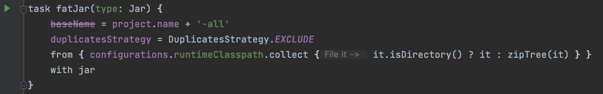
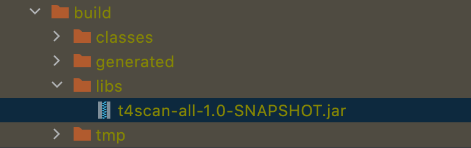
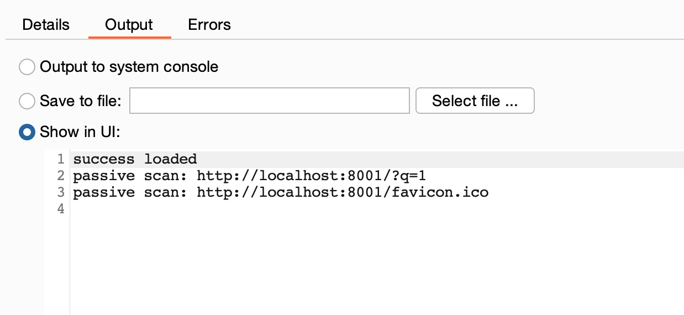
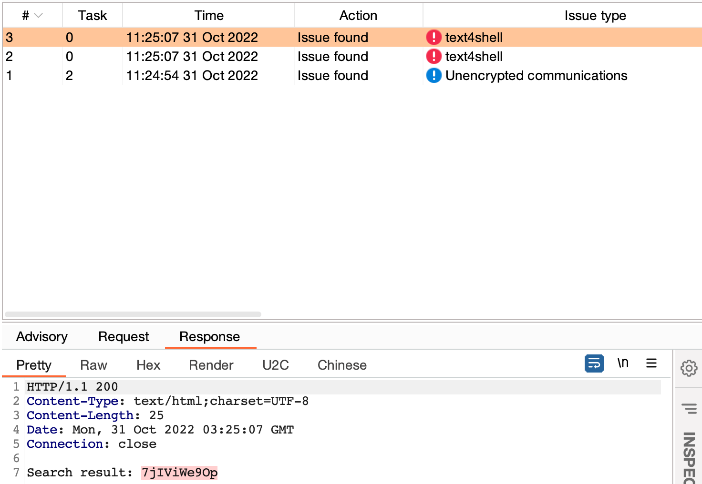

# 🔥 T4scan
A burp plugin for text4shell passive scan

## 📦How to install
### ⏬Download
You can download complied jar from release or build from source.
### 🔨Build from source
First clone the project
```
git clone https://github.com/YulinSec/t4scan
```
Then open it by IDEA, run task fatJar in build.gradle

You can find compiled jar in build/libs/t4scan-all-1.0-SNAPSHOT.jar

### 🚀Install to burp
Install this plugin as a java plugin in extender panel.

## 🔮Images
After t4scan installed, it will automatically get http request sent by burp, and inject payloads to find text4shell, including echo and dns.
You can find urls scanned in stdout of t4scan. 

When it found a text4shell, it  will alert an issue.

For more details, please go and look at source code.